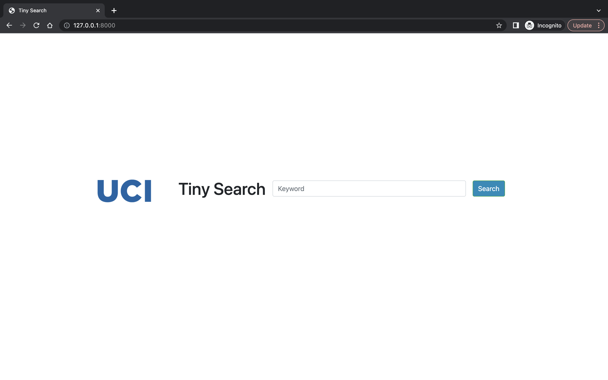
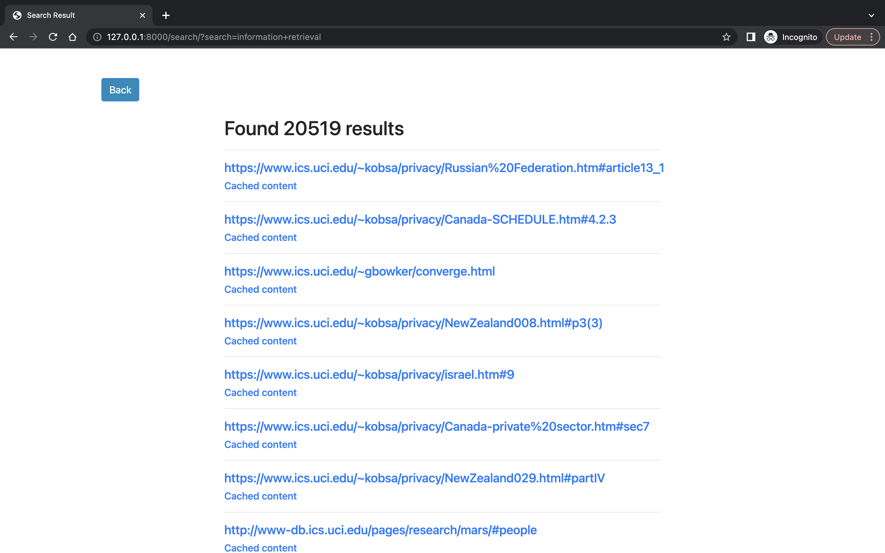

# Tiny Search Engine
This repository implements a simple search engine that works with UCI ICS domain webpages.

## Documents data
The provided dataset, developer.zip, contains data that was gathered by web crawlers from 88 domains associated with ICS. The dataset consists of a little under 56,000 web pages, which are stored in folders with one folder per domain. Each file inside a folder corresponds to one web page, and the files are stored in JSON format with two fields: "url" and "content."

The "url" field contains the URL of the web page, and the "content" field contains the content of the page as found during crawling. It is important to note that some of the pages in the dataset may not contain any HTML at all, and when they do, it may not be well-formed. For example, there might be an open <strong> tag but the associated closing </strong> tag might be missing. Therefore, it is important to select a parser library that can handle broken HTML when working with this dataset.
## How to run
### Step 0
Setup python environment.
```sh
pip install -r requirements.txt
```
Prepare the dataset. Download [developer.zip](https://www.dropbox.com/s/vcfy7ad3osqyx23/developer.zip?dl=0) and unzip it under pageset directory.

### Step 1 
Build the inverted index and calculate the tf-idf score matrix. The below command will generate `inverted_index.pkl` and `tfvectorizer.pkl`. If `tfvectorizer.pkl` already exists then the script loads the existing tf-idf matrix and use it to build the inverted index. 
```sh
python build_index.py
```

### Step 2
Run GUI interface with the following command.
```sh
python manage.py runserver
```
This will locally run the tiny search server.

### Test
Run a test search on 20 evaluation queries
```sh
python search.py
```
This will write retrieval results for 20 test queries in tests directory.

## Preview
#### Main search page

#### Result page


## Design

### Detect and eliminate duplicate pages
Tiny search used simhash to remove duplicate pages in the dataset.

[paper](https://static.googleusercontent.com/media/research.google.com/en//pubs/archive/33026.pdf)

### Inverted index

token | (document_id, location_list, tf-idf_score, important_mutiplier)

where document_id is a URL of the document.

important_multiplier:
2: if token is in h3 tag
3: if token is in h2 tag
4: if token is in h1 tag
5: if token is in title tag

#### Merging
1. Build the inverted index until 5000 urls
2. Write the partial index to disk. This will write a number of shard{idx}.json files in index directory.
3. Merge partial index in alphabetical order
4. Store the index in multiple files. This will store the entire inverted index in multiple token_shard{idx}.json files in index directory.


### Search
* term-at-a-time
Tiny search process a query term by term. It iteratively fetch the inverted index for tokens in the query sequentially and cumulate the weight for each url. In the end, fetched urls are sorted according to their weights.


### Ranking
final_score = tf_idf_cosine_score * important_multiplier

* TF-IDF score

* Important words
h1, h2, h3, and title is considered.

### Graphic user interface
GUI for tiny search is built with Django.

## Test queries
The performance of tiny search engine was evaluated in terms of ranking performance (effectiveness) and in terms of runtime performance (efficiency) of 20 test queries.

### Queries that produce satisfactory outcomes
* NIPS
* Iftekhar Ahmed
* how to write code
* graph algorithm
* apple
* famous conference
* Chicago Recommendation Data
* michael franz
* python
* linear regression


### Queries yielding unsatisfactory outcomes.
* machine learning
* information retrieval
* cs221
* pierre baldi
* Definition of search engine
* mobile security
* dean of computer science
* computer network
* compiler lecture
* This is very long queries without any special meaning but you need to find out the proper results

1. Some results are not about machine learning but only containes a lot of either machine or learning.
distill out pages containes all the words in query, use word position

2. dummy pages that is unimportant but containes a lot of keywords 
important word with special tag

3. too many duplicate pages
simhash

4. too much time for common words
reduce the size of token shard
skip some urls

5. important words in query should be weighted more
tf-idf

